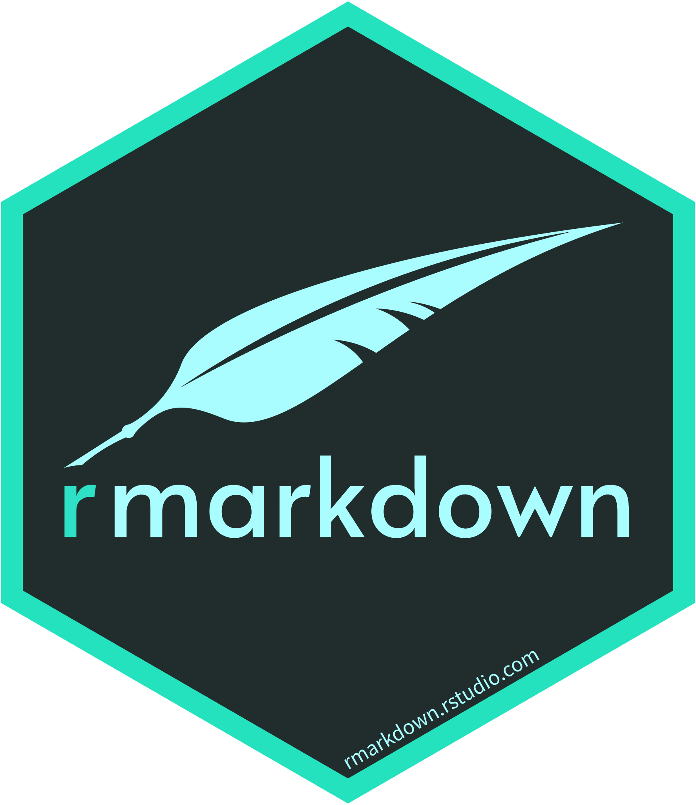
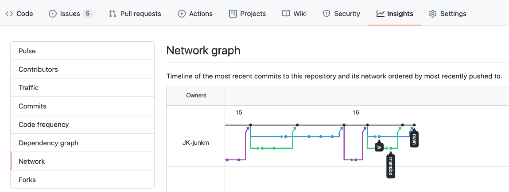
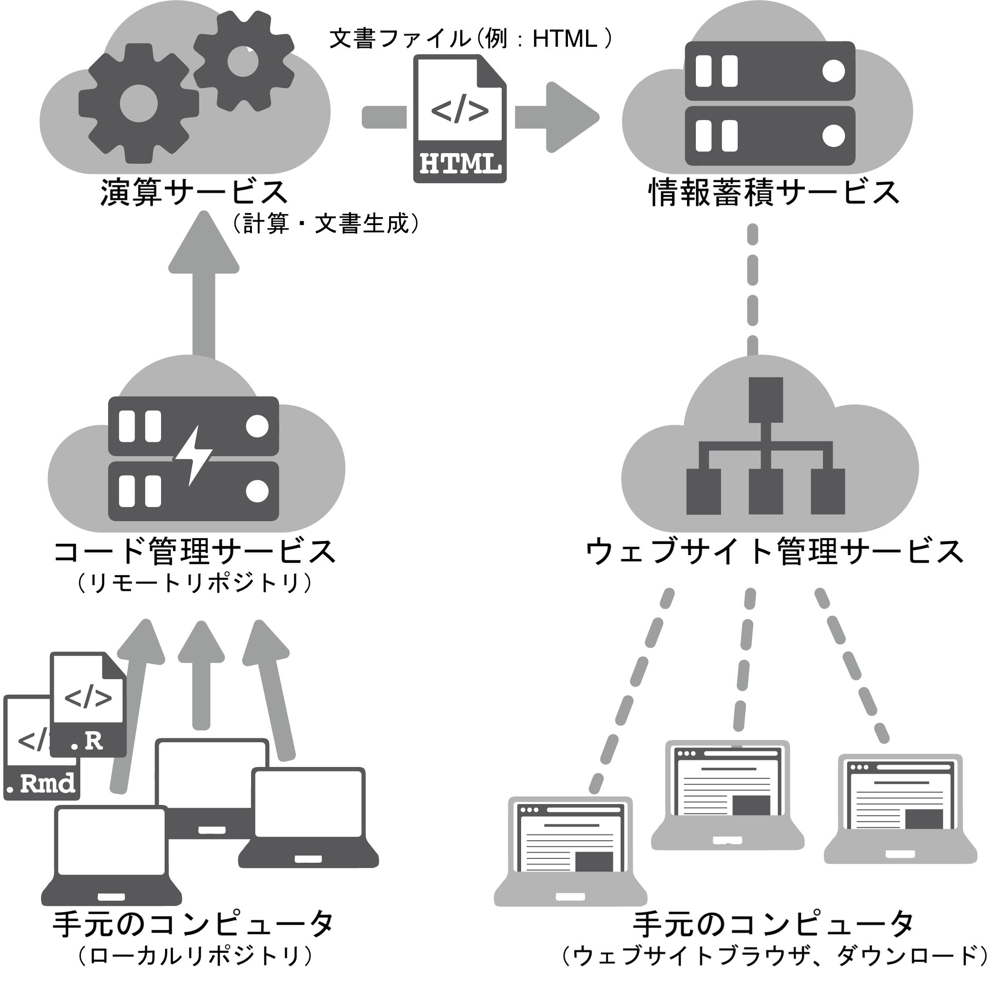

```{r setup, include=FALSE}
knitr::opts_chunk$set(echo = TRUE)
#     powerpoint_presentation:
#         reference_doc: ref.potx
image_link <- function(image,url,...){
  htmltools::a(
    href=url,
    htmltools::img(src=image,...)
    )
}
```


# __背景と着眼__
__現状__ 改正漁業法の下で資源評価対象魚種が拡大する一方、人的リソースは限られる。  
<br></br>
__変化__ このような状況下で、資源評価の透明性・再現性・客観性の要求は高まっており、  
　　 担当者の負担はますます大きくなっている。  
<br></br>
__問い__ この状況に適応するためには働き方（考え方）を変化させていく必要があるのではないか。  
<br></br>
そこで、現状の資源評価業務の流れを整理し、ソフトウェア開発手法の適用によって  
効率化や手順の改善が可能かを検討する。  
<br></br>
`r emo::ji("check")` なお、このプレゼンで示した内容は  
　 Hayashi A, Ichinokawa M, Kinoshita J, Manabe A (2021)   
　 Optimizing stock assessment workflows by applying software development methodology.  
　 Fisheries Research, 244, 106108. https://doi.org/10.1016/J.FISHRES.2021.106108  
　 で詳述されている。  

# __現状の資源評価業務の"例"__
資源評価業務は __データ整理から始まり、数値計算、ドキュメント作成までの流れ作業__ であり、  
主担当者は全ての工程を多能工的にこなしている。その上で、  

1. ドキュメント作成の際に、図表等の検索・選択・取得をマウス操作などの手作業で行う必要がある  
    * 検索の手間と選び取りミスの危険がある（この作業は他者からは見えない）。  
    * 多量の単純作業——数値や図表のコピーアンドペーストなど——が存在する。  
    * 大量の情報・ファイルの管理を行う必要がある。  
  
2. 複数のシナリオを検討する必要がある  
    * シナリオ数（試行錯誤回数）が増えるほど単純作業とファイル管理のコストが増す。
  
3. ドキュメント（ドラフト）を生成して初めて他人からのフィードバックがある  
    * スペルミスなどへの細かな指摘から  
      数値の転記ミスなど注意を要する重要な指摘、  
      さらに、どのシナリオを選ぶかなどの大きな指摘までがこの段階でなされる。  
    * 単純作業に労力を取られて、本質的な問題にたどり着くまでに時間がかかる可能性がある。  

# __状況改善の"案"__
__作業の最終工程であるドキュメント作成を流れの起点にする__ という逆転の発想の下で、  
可能な限りヒューマンエラーを減らす方法をソフトウェア開発手法から学ぶ。  
<br></br>

1. ドキュメントに情報へのリンク（パス）を書き込み、図表や数値が自動引用、  
   自動更新される仕組みを使う  

    `r emo::ji("wrench")`ツール例: __R, Rmarkdown__
    `r knitr::include_graphics(R.home("doc/html/logo.jpg"))`
    ```{r out.width = "100px", echo = FALSE} 
        
    ```

    * パスを書き込むことで、どの情報を選び取ったかが明確になる（透明性の確保） 

    * データの転記ミス等が減る（再現性の向上） 

    * 図表や数値はその都度計算するため、図表保存などを行う必要が無い（整理性の向上）

    * 一度パスを構築してしまえば、次回からはコピペなどの単純作業を行わなくて済む（省力化） 


`r emo::ji("scorpion")` RとRmarkdownのコーディング技術の習得が必要  

# __状況改善の"案"__
2. 多数のシナリオを管理しやすい仕組みを使う  
<br></br>
    ```{r echo = FALSE}
            image_link(image = "figures/Git-Logo-2Color.png",
                       url   = "https://git-scm.com",
                       width = "200px",
                       align = "right")
    ```
    `r emo::ji("wrench")`ツール例: __Git__（バージョン管理システム）
<br></br><br></br>
    * 更新履歴の管理を行うシステム  

    * 更新履歴の管理に止まらず（多人数での）並列開発を念頭に作られたツール  

    * ファイルの派生を同時に追従し、管理できる（ブランチング）  

    * ブランチ（派生）は必要に応じて統合できる

`r emo::ji("scorpion")` このツールの仕組みの理解および取扱技術の習得が必要  
<br></br>
`r emo::ji("check")` GitHub上での共同開発履歴の例（本プレゼン資料）
```{r out.width = "700px", fig.align = "center", echo = FALSE} 
    
```


# __状況改善の"案"__
3. フィードバックを得やすい仕組みを使う  
<br></br>
    ```{r echo = FALSE}
       image_link(image = "figures/Octocat.jpg",
                  url   = "https://github.com",
                  width = "120px",
                  align = "right")
    ```
    `r emo::ji("wrench")`ツール例: __GitHub、Amazon S3__（クラウドサービス）
<br></br><br></br>
    * 例えば、数値が異常に大きいなどの経験知をテストプログラムとして組み込み、  
      それが検知されたときはシステムが停止する（バグの発見）  
      `r emo::ji("point_right")` システムに人間の知恵を付加するという「自働化」の考え方  

        * こうした経験知は暗黙知である場合も多いため、  
          テストプログラムとして明文しておくことで透明性の確保にもつながる  

    * クラウドサービス上で最新のドキュメントが閲覧できる  
        * これはプログラムが全てのテストを無事通過したことを意味する  
          `r emo::ji("point_right")` テストが充実していればドキュメントの信頼性が向上する
        * ウェブブラウザを介して閲覧できるので他者がレビューしやすい

    * クラウドサービス上にコードを格納するため、複数人で同時に開発が可能  
      `r emo::ji("point_right")` 他の人の作業完了を待つ必要が無い


`r emo::ji("scorpion")` ソフトウェア（パッケージ）として開発する必要  
`r emo::ji("scorpion")` パッケージを共同開発する文化が必要  
`r emo::ji("scorpion")` クラウドサービスの取扱技術の習得  
`r emo::ji("scorpion")` レビュワーもクラウドサービスを扱える必要  

# __CIドキュメントシステムの流れ（例）__
1. Excelファイルに各種データを整理する: Excelファイルをデータベースとする  
2. `R`にExcelファイルのデータを読み込む  
3. `R`および`Rmarkdown`を用いてドキュメントを作成する（数値計算、出力フォーマットの指定）  
4. 作成したドキュメントをクラウドサービス（GitHub）にアップロードする  
5. クラウドサービス上でドキュメントが自動的に生成される（PDFやWord、HTMLなど）
6. 生成されたドキュメントが（関係者に）自動的に公開される  
7. （クラウドサービスを介して）レビューを受ける  
8. ドキュメントを改訂する  

以下、繰り返し。  
```{r out.width = "600px", fig.align = "center", fig.cap = cap, echo = FALSE} 

cap <- glue::glue(
    '図. CIドキュメントシステムの構造  
    雲形の背景画像はクラウドサービスを表す。  
    Hayashi et al. (2021) のFig.1 を一部改変して示した。')
```

# __結果はどうなる__ 
1. __ドキュメント生成の自動化__
    * 使用したデータ、解析方法、異常数値の知見の可視化による __再現性の担保__
    * 情報の追加更新で行われるドキュメントの自動生成による新バージョンへの追従
    * ドキュメントのバージョン管理による、議論のしやすさの向上

2. __仕事の見える化__
    * 誰がどのような仕事をしたか  
    * 誰が何を決めたか  
    * 議論の内容の文字化  

3. __仕事の省力化__  
    * コピペなどの単純作業の低減  
    * `R`パッケージとして開発されていれば、他の担当者の有用なコードを導入しやすい。  

# __課題・留意点__
1. 新しいツールの学習コスト  
2. 多魚種に共通のパッケージを作るには大規模で相当な労力が必要  
3.  

* 必要な情報のみを必要な時に取り込む「ジャスト・イン・タイム」の考え方  

* ドキュメントに必要な情報が明確でないと、この手法は却って混乱を生み出す。  

* ソフトウェア開発手法の適用ではあるが、全てのソフトウェア開発会社がこの方法を採用しているわけではない。  
  実際にうまくいっている例もあるだろうが、開発と運用に関わる全ての人がこの方法を理解し、  
  継続的な改善に協力的でないと破綻する。改善には10年以上かかる例もざらであるようだ。  

* Microsoft Office系のソフト（WordやExcel等）でもいわゆるマクロやクエリを使えば  
  できるのかもしれない。つまりは、本気度に由来する。  

# __リーン生産方式__
1. 作業手順の改善を探求し続ける  
    * ムダの認識と撲滅  
    * ムダ（問題点）を発見するために５回の「なぜ」を常に自らに問う  
    * ムダの分類（例）  
        1. コピペなどの単純作業の増加
        2. （単純作業の）未完の作業
        3. 遅れや待ち  
        4. 欠陥  
        5. タスクの切り替えにかかる時間  
        6. 余分な機能  
        7. 不要な引継ぎ  
2. 手順改善では対応できない部分を設備改善（使う道具）で補う  
    * 新しい道具に習熟しようとする気概を持つ  
3. 働き方を変えるには長い時間と多くの労力が必要であることを認める  

# __まとめ｜「複雑化する資源評価業務との付き合い方」とは何か__
1. 属人化から標準化へ

    * 属人化された知識をメモのみならずコードとして保存

    * 引継ぎのたびに失われる知識を保全する

    * 各魚種ごとに標準化されたフローや知識を残し、誰でも資源評価を出来るようにする

2. ミスの削減

    * 自働化によってコピペミスや数値の取り扱いミスが減少する

    * 自動化によって研究の再現性が向上し、研究の頑健性があがる

    * ミスの減少と、研究の頑健化は次の研究へ進む余裕を生み出す

3. バージョン管理されたコードベースの仕事

    * 管理や整理コストを削減し、ファイル間の連携性が容易になる

    * コードベースのやりとりやGithubなどでの共同作業により、問題解決性が向上する

    * シナリオ分岐が容易になり、より高度な解析への足がかりとなる

