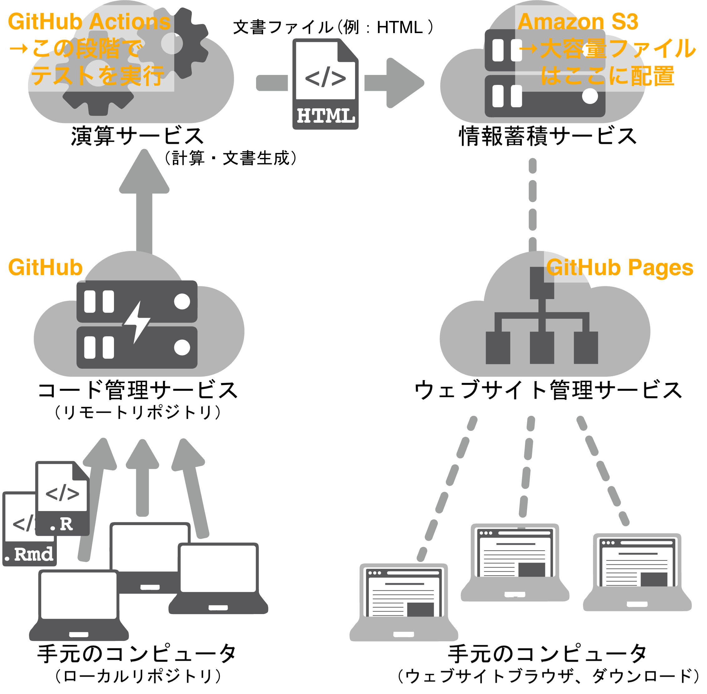

```{r setup, include=FALSE}
knitr::opts_chunk$set(echo = FALSE,
                      class.source = "numberLines lineAnchors")
image_link <- function(image,url,...){
  htmltools::a(
    href=url,
    htmltools::img(src=image,...)
    )
}
```

## __背景と着眼__
__現状__ 改正漁業法の下で資源評価対象魚種が拡大する一方、人的リソースは  
　　 限られる。

__変化__ このような状況下で、資源評価の透明性・再現性・客観性の要求は  
　　 高まっており、担当者の負担はますます増えている。

__問い__ この状況に適応するためには働き方（考え方）を変化させていく必要が  
　　 あるのではないか。

そこで、現状の資源評価業務の流れを整理し、ソフトウェア開発手法の適用によって効率化や手順の改善が可能かを検討する。

※なお、このスライド資料で示した内容の詳細は  
　 Hayashi A, Ichinokawa M, Kinoshita J, Manabe A (2021)  
　 Optimizing stock assessment workflows by applying software  
　 development methodology. Fisheries Research, 244, 106108.  
　 https://doi.org/10.1016/J.FISHRES.2021.106108  
　 に掲載されています。

## __現状の資源評価業務の"例"__
資源評価業務は __データ整理から始まり、数値計算、ドキュメント作成までの流れ作業__ であり、
主担当者は全ての工程を多能工的にこなしている。その上で、  

1. ドキュメント作成の際に、図表等の検索・選択・取得をマウス操作などの手作業で行う必要がある
    * 検索の手間と選び取りミスの危険がある（この作業は他者からは見えない）。
    * 多量の単純作業—数値や図表のコピーアンドペーストなど—が存在する。
    * 大量の情報・ファイルの管理を行う必要がある。

2. 複数のシナリオを検討する必要がある
    * シナリオ数（試行錯誤回数）が増えるほど単純作業とファイル管理のコストが増す。

3. ドキュメント（ドラフト）を生成して初めて他人からのフィードバックがある
    * スペルミスなどへの細かな指摘から  
      数値の転記ミスなど注意を要する重要な指摘、さらに、  
      どのシナリオを選ぶかなどの大きな指摘までがこの段階でなされる。
    * 単純作業に労力を取られて、本質的な問題にたどり着くまでに時間がかかる  
      可能性がある。

## __状況改善の"案"__
__作業の最終工程であるドキュメント作成を流れの起点にする__ という逆転の発想の下で、
可能な限りヒューマンエラーを減らす方法をソフトウェア開発手法から学ぶ。


1. ドキュメントに情報へのリンク（パス）を書き込み、図表や数値が自動引用、
   自動更新される仕組みを使う

    `r emo::ji("wrench")` ツール例: __R, Rmarkdown__
    $\vcenter{\hbox{\includegraphics[height=1cm]{/Library/Frameworks/R.framework/Resources/doc/html/logo.jpg}}}
     \vcenter{\hbox{\includegraphics[height=1cm]{figures/rmarkdown.png}}}$

    * パスを書き込むことで、どの情報を選び取ったかが明確になる（透明性の確保）

    * データの転記ミス等が減る（再現性の向上）

    * 図表や数値はその都度計算するため、図表保存などを行う必要が無い（整理性の向上）

    * 一度パスを書いてしまえば、次回からはコピペなどの単純作業が不要（省力化）

\textcolor[rgb]{1,0,0}{！RとRmarkdownのコーディング（プログラミング）技術の習得が必要}

## __状況改善の"案"__
2. 多数のシナリオを管理しやすい仕組みを使う

    ```{r echo = FALSE}
#             image_link(image = "",
#                        url   = "https://git-scm.com",
#                        width = "200pt",
#                        align = "right")
    ```
    `r emo::ji("wrench")` ツール例: [__Git__](https://git-scm.com)（バージョン管理システム）
     $\vcenter{\hbox{\includegraphics[height=1cm]{figures/Git-Logo-2Color.png}}}$

    * 更新履歴の管理を行うシステム

    * 更新履歴の管理に止まらず（多人数での）並列開発を念頭に作られたツール

    * ファイルの派生を同時に追従し、管理できる（ブランチング）

    * ブランチ（派生）は必要に応じて統合できる

\textcolor[rgb]{1,0,0}{！このツールの仕組みの理解および取扱技術の習得が必要}

* ブランチングでの共同開発履歴の例（本スライド資料）
```{r out.width = "300pt", fig.align = "center"}
    
```


## __状況改善の"案"__
3. フィードバックを得やすい仕組みを使う

    ```{r echo = FALSE}
#        image_link(image = "figures/Octocat.jpg",
#                   url   = "https://github.com",
#                   width = "20pt",
#                   align = "right")
    ```
    `r emo::ji("wrench")`ツール例: [__GitHub__](https://github.com) 、Amazon S3（クラウドサービス）
     $\vcenter{\hbox{\includegraphics[height=1cm]{figures/Octocat.jpg}}}$

    * 例えば、数値が異常に大きいなどの経験知をテストプログラムとして組み込み、
      それが検知されたときはシステムが停止する（問題箇所の発見）  
      →システムに人間の知恵を付加するという「自働化」の考え方  
      →こうした経験知は暗黙知である場合も多いため、テストプログラムとして  
      　明文しておくことで透明性の確保にもつながる
    * クラウドサービス上で最新のドキュメントが閲覧できる  
      →これはプログラムが全てのテストを無事通過したことを意味するので、  
      　「テストが充実していれば」ドキュメントの信頼性が向上する  
      →ウェブブラウザを介して閲覧できるので他者がレビューしやすい  
      →レビューしているドキュメントのバージョンが、  
      　レビュワー間で異なるというすれ違いを低減できる  
    * クラウドサービス上にコードを格納するため、複数人で同時に開発が可能  
      →他の人の作業完了を待つ必要が無い  

\textcolor[rgb]{1,0,0}{！ソフトウェア（パッケージ）として開発する必要}  
\textcolor[rgb]{1,0,0}{！パッケージを共同開発する文化が必要}  
\textcolor[rgb]{1,0,0}{！クラウドサービスの取扱技術の習得と仕組みの理解（レビュワーも）}  

## __CIドキュメントシステムの流れ（例）__
::: columns
:::: column
1. Excelブックに各種データを整理  
   →これをデータベースとする  
2. Excelブックのデータを`R`に読込  
3. `R`および`Rmarkdown`を用いてドキュメントを作成  
   （数値計算、出力様式の指定）  
4. 作成したドキュメントを __GitHub__ にアップロード  
5. クラウドサービス上で文書が自動生成される（PDF, Word, HTML）  
6. 生成された文書が関係者に自動的に公開される  
7. GitHub上でレビューを受ける  
8. ドキュメントファイルを改訂  
  
以下、繰り返し。

::::
:::: column

```{r out.width = "140pt", fig.align = "center", fig.cap = cap}

cap <- glue::glue(
    '図. CIドキュメントシステムの構造
    雲形の背景画像はクラウドサービスを表す。
    Hayashi et al. (2021) のFig.1 を一部改変して示した。')
```

::::
:::

## __結果はどうなる__
1. __ドキュメント生成の自働化__
    * __再現性の向上__ 使用したデータ、解析方法、暗黙知の明文化
    * __透明性の確保__ ドキュメントのバージョン管理（派生も含めて）
    * __信頼性の向上__ 転記・更新漏れなどの低減、異常数値等の自動検出
    * __省力化__ コピペなどの単純作業の低減、年次更新への素早い対応

2. __仕事履歴の見える化__（主にGitHub上で）
    * 誰がどのような仕事をしたか
    * 誰が何を決めたか
    * 議論の内容の文字化

3. __着実な向上__
    * `R`パッケージとして開発されていれば、他の担当者の有用なコードを導入できる。
    * これにより、組織全体として重複作業の削減につながる。
    * さらに、余裕ができることで、より本質的な問題に割く時間を確保しやくなる。

## __課題・留意点__
* ドキュメントに必要な情報が明確でないと、却って混乱を生み出す。  
→ 予め関係者間でドキュメント要件を合意しておくことが重要

* 新しいツール（R, Rmarkdown, Git, GitHub）の学習コスト  
→ 自分だけでなく、例えば後任の人にも学習をお願いすることになる。

* 多魚種に共通のパッケージを作るには大規模で相当な労力が必要  
→ 各魚種に特有の暗黙知がある（はず）  
→ データ整理の仕方も様々  

* Microsoft Office系のソフト（WordやExcel等）でもマクロやクエリを  
  使えばできるのかもしれない。

## __結び｜「複雑化する資源評価業務との付き合い方」とは何か__
1. 継続的な品質向上を目指した、少人数での大量生産方法の模索

    * ドキュメント生成の自働化によってコピペミスや数値の取り扱いミスが減少する
    * 自動化によって研究の再現性が向上し、研究の頑健性があがる
    * 単純作業の減少と、研究の頑健性向上は次の研究へ進む余裕を生み出す

2. 属人化から標準化へ

    * 属人化された知識をメモのみならずコードとして保存
    * 引継ぎのたびに失われる知識を保全する
    * 各魚種ごとに標準化されたフローや知識を残し、誰でも資源評価を出来るようにする

3. バージョン管理されたコードベースの仕事

    * ファイルの管理や整理コストを削減し、ファイル間の連携性が容易になる
    * コードベースのやりとりやGitHub上などでの共同作業により、問題解決性が向上する
    * シナリオ分岐が容易になり、より高度な解析への足がかりとなる

## __参考｜リーン生産方式__
* 本スライド資料で示した方法はソフトウェア開発の現場で用いられている  
  リーン生産方式（ムダの少ない生産方式）を参考にしています。  
  そのコンセプトは、  

  1. プロジェクトの __価値__ を明確にする
  2. __価値の流れ__ を明確にする
  3. 工程間の作業速度を可能な限り均すことで __流れを止めない__
  4. __後工程から前工程に__ タスクを取りに行く
  5. 流転するユーザーの要求を完全に満たすよう改善を __続ける__

　　の5項目から成ります（Hayashi et al. 2021）。

* リーン生産方式の元となったのは、トヨタ自動車が自動車製造の現場で  
  昭和20年代初頭から実践されているトヨタ生産方式に由来するようです。  
  　トヨタ生産方式は、製品が自動車なので究極の安全品質を確保しながらも、  
  原価低減による利益増大を達成するためには徹底したムダの排除しかない、  
  という信念の下、30年近い年月をかけて形になった（今なお改善され続けている）生産方式です。

* ソフトウェア開発や自動車生産など、資源評価業務の現場とはかけ離れた存在に感じますが、
  __品質を維持・向上しながらユーザーの要求の変化に対応し続ける__ という特徴は資源評価業務にも共通する部分があると思います。

## __補足｜資源評価とリーン生産方式__
資源評価業務でそれを実現するためには、（当たり前のことかもしれませんが）

1. 作業手順を改善し続ける
    * ムダの認識と撲滅
    * ムダの分類（例）
        1. コピペなどの単純作業の増加
        2. （単純作業の）未完の作業
        3. 遅れや待ち
        4. 欠陥
        5. タスクの切り替えにかかる時間
        6. 余分な機能
        7. 引継ぎにかかる労力（引き継がれない暗黙知）
    * ムダ（問題点）を発見するために５回の「なぜ」を常に自らに問う
2. 手順改善では対応できない部分を設備改善（使う道具）で補う
    * 新しい道具に習熟しようとする気概を持つ
3. 働き方を変えるには長い時間と多くの労力が必要であることを認める
    * 個人的な技術向上から組織を上げての変革まで

などの継続的な行動と、強い意思が必要だと考えています。

## __補足｜Rmarkdownファイルのサンプル__ 
* 数値計算および文章中への数値引用例を示したRmarkdownファイルサンプル（`example.Rmd`）を
  この[リンク先](https://raw.githubusercontent.com/JK-junkin/gakkai_FO202111/main/example.Rmd)
  からダウンロードできます。コードをコピーし、メモ帳などのテキストエディタに張り付けて保存してください
  （このとき拡張子は __`.Rmd`__ で保存してください）。

```{r out.width = "200pt", fig.align = "center"}
    
```

* その`example.Rmd`ファイルを`R`（または __RStudio__ などのR用IDE）で開き、
  コンソール上で下記の２つのコードを実行すると、`example.Rmd`があるフォルダに
  `example.html`が生成されるはずです。

    \scriptsize
    ```{r eval = FALSE}
      install.packages(c("tidyverse", "rmarkdown", "bookdown"))
      rmarkdown::render("example.Rmd")
    ```
    \normalsize

* `example.html`をダブルクリックしてどのようなドキュメントが生成されたかを
  確認してみて下さい。また、`example.Rmd` を改変してみて下さい。

## __補足｜本発表資料の作成について__ 
* 本発表の資料（スライド）は __Rmarkdown__, __Git__, __GitHub__ を用いて複数人で同時作成しました。
発表資料作成に使用したコードはGitHubの公開レポジトリに格納されています。  
レポジトリURL：https://github.com/JK-junkin/gakkai_FO202111

```{r out.width = "300pt", fig.align = "center"}
    
```

## __参考文献・サイト等__ 
* Hayashi A, Ichinokawa M, Kinoshita J, Manabe A (2021)
  Optimizing stock assessment workflows by applying software development methodology.
  Fisheries Research, 244, 106108. https://doi.org/10.1016/J.FISHRES.2021.106108

* 大野耐一 (1978)
  『トヨタ生産方式—脱規模の経営を目指して—』ダイヤモンド社. pp.232.

* 高橋康介 (2018)
  『再現可能性のすゝめ—RStudioによるデータ解析とレポート作成—』
  Wonderful R vol.3, 石田基広監修. 共立出版. pp.161.

* Jennifer Davis, Ryn Daniels 著, 吉羽龍太郎 監訳, 長尾高弘 訳 (2018)
  『Effective DevOps—4本柱による持続可能な組織文化の育て方—』
  オライリー・ジャパン. pp.341.

* 市谷聡啓, 新井剛 (2018)
  『カイゼン・ジャーニー—たった1人からはじめて、「越境」するチームをつくるまで—』
  翔泳社. pp.279.
